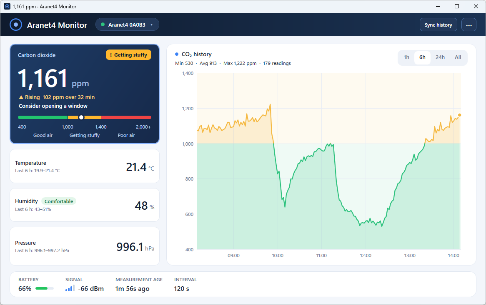

# Aranet4 Monitor for Windows

**An unofficial Aranet4 Windows app for monitoring [Aranet4](https://aranet.com/products/aranet4-home/) sensors over Bluetooth LE.**

Monitor your Aranet4 in real time, view historical measurements, export data to CSV, and receive configurable CO₂ ventilation alerts.

**[⬇️ Download the latest release](../../releases/latest)**



## Features

* **Live readings** — CO₂, temperature, humidity, pressure, battery, and signal strength
* **Sensor history** — Download and synchronize stored measurements
* **Charts & CSV export** — Explore historical data and export measurements
* **Ventilation alerts** — Configure CO₂ thresholds and alert duration
* **System tray** — Monitor your sensor without keeping a window open
* **Local storage** — Your history and settings stay on your PC; no account or cloud service

> **Independent project:** Aranet and Aranet4 are referenced only to identify compatible hardware. This project is not affiliated with or endorsed by the manufacturer.

## Download

**Latest release: [v1.0.0](../../releases/latest)**

Download the ZIP matching your Windows processor architecture:

* **win-x64** — 64-bit Intel/AMD Windows PCs
* **win-arm64** — Windows on ARM devices
* **win-x86** — 32-bit Windows

Extract the downloaded ZIP to a folder and run:

```text
Aranet4Monitor.exe
```

The application is self-contained, so you **do not need to install the .NET SDK or .NET Desktop Runtime**.

> **Windows SmartScreen:** The application is currently unsigned, so Windows may display a SmartScreen warning when you first run it. Only download releases from this repository and run software you trust.

### Building from source

If you prefer to build the application yourself, you can use the `.NET 10 SDK` on Windows:

```powershell
dotnet run --project src/Aranet4Monitor/Aranet4Monitor.csproj
dotnet test Aranet4Monitor.sln
```

To create a self-contained x64 release:

```powershell
dotnet publish src/Aranet4Monitor/Aranet4Monitor.csproj `
  --configuration Release `
  --runtime win-x64 `
  --self-contained true
```

## Privacy and data storage

The app communicates with the nearby sensor over Bluetooth LE. There is no analytics, telemetry, account, or cloud-upload feature in this repository.

* Sensor history and sync cursors are stored as JSON in `%LOCALAPPDATA%\AranetHome\history\`, with files keyed by the sensor's Bluetooth address.
* Preferences, including alert settings and last-alert details, are stored in `%LOCALAPPDATA%\AranetHome\settings.json`.
* These files are not encrypted by the app. History is retained when you clear the detected-device list and when you remove the application. Delete `%LOCALAPPDATA%\AranetHome\` to remove the saved data.
* **Start with Windows** creates a per-user Windows startup entry. Turn it off from the tray menu before deleting the application if you no longer want it to start automatically.
* CSV exports are written to the location you choose.

## CO₂ readings and safety

This app is not a certified safety, medical, or emergency-warning device. CO₂ readings are a broad indicator of ventilation; they do not establish that air is safe. Sensor readings can be missing, stale, or affected by placement and connectivity. Do not use this app in place of required safety monitoring or professional guidance.

The default alert is 1,500 ppm sustained for 10 minutes, and it rearms at or below 1,400 ppm. These are configurable app settings, not HSE-prescribed timing. See the [UK Health and Safety Executive guidance on CO₂ monitors](https://www.hse.gov.uk/ventilation/using-co2-monitors.htm).

## Troubleshooting

* **No sensor detected:** Enable Bluetooth, keep the sensor nearby, and check that your Windows adapter supports Bluetooth LE.
* **No live measurements:** Live readings require the sensor's Smart Home Integration BLE broadcasts. Check the sensor's broadcast setting and battery.
* **History sync fails:** Keep the sensor nearby and complete any Windows pairing prompt. If a sync is cancelled or interrupted, retry it; the cursor advances only after a complete transfer is saved.
* **Stale tray reading:** The tray icon turns grey after the sensor has not been heard from for five minutes. Check distance, battery, and Bluetooth.

## Acknowledgements

The [Aranet4-Python project](https://github.com/Anrijs/Aranet4-Python) is a protocol research reference. See [THIRD-PARTY-NOTICES.md](THIRD-PARTY-NOTICES.md) for the specific sources and attribution. The app's protocol and sync tests use local fixtures and do not require a sensor.

## License

This project is licensed under the [MIT License](LICENSE).
